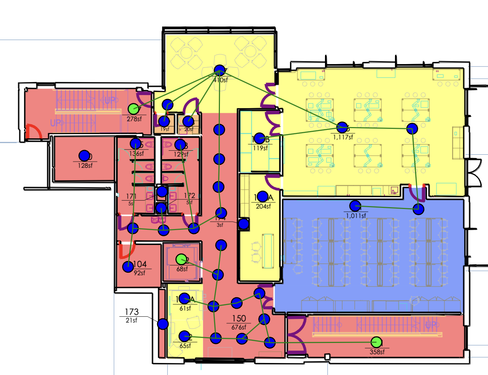

# FloorPlan-to-Graph

## What Does This Project Do?

[Brief Overview Video Link](https://drive.google.com/file/d/18ramxavhmxso4jwCGj3SCaQuEz05B-_Q/view?usp=sharing)

This project is an interactive interface that allows the user to generate graphs from floor plan pdfs.

## To Run the Project

### First Time User

- Step 1: git clone
- Step 2: cd Floorplan-to-Graph
- Step 3: npm i
- Step 4a (optional): python3 -m venv .venv
- Step 4b (optional): source .venv/bin/activate
- Step 4c: pip3 install -r 'requirements.txt'
- Step 5: npm run dev

### Returning User

- Step 1: cd Floorplan-to-Graph
- Step 2: source .venv/bin/activate
  - _You should do this step iff you did the optional steps as a first time user._
- Step 3: npm run dev

## Documentations

[Home Page](https://docs.google.com/document/d/1OfsCcJrhJLZdvOeIBf8QRFbJN2hEpRGTN8pyo9jipy4)

[Main Page](https://docs.google.com/document/d/1-cCIbMQp5eLcjvXO46XwQY86PnqABLn0Ts0VEIpT6AM)
